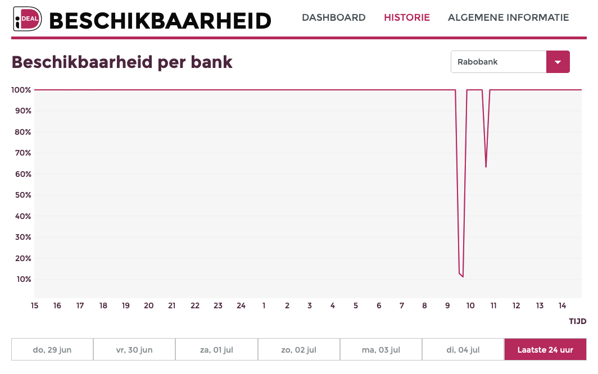

=================================================
CIA - Confidentiality, Integrity and Availability
=================================================

Confidentiality, Integrity en Availability, vertaald in het Nederlands Vertrouwelijkheid, Integriteit en Beschikbaarheid (de "BIV-driehoek") is één van de grondbeginselen van informatiebeveiliging
In de basis heb je te kijken naar alle drie van de begrippen. Je kan ook niet één van de onderdelen weglaten, want dan zou je te kort doen aan het geheel van informatiebeveiliging.

Vertrouwelijkheid
-------------------------------------

Vertrouwelijkheid is het begrip dat **alleen de mensen die bij de informatie kunnen die er bij moeten kunnen**.
Als je bijvoorbeeld een bank neemt, dan is het fijn om te weten dat alleen geschikte/gescreende bankmedewerkers bij jouw bankinformatie kunnen. 

Integriteit
-------------------------------------
Integriteit is een iets lastiger te begrijpen onderdeel van informatiebeveiliging. Waarschijnlijk omdat *wij* alleen maar bezig zijn met hackers.

Integriteit geeft aan dat **de data die je hebt ook daadwerkelijk klopt**. Bij de bank zou het fijn zijn dat als je €110.000 op je rekening hebt staan, dat de app niet aangeeft dat je €10.- op je rekening hebt staan.
Een misschien extremer voorbeeld is dat het bedrag op je rekening *aangepast* wordt naar iets wat niet klopt. Stel je voor dat de bank zelf óók de overtuiging heeft dat die €110.000 *verschwunden* (Duits: verdwenen, sorry, zal het nooit meer doen) is. Dan wordt de situatie toch wel heel erg vervelend.

Beschikbaarheid
-------------------------------------
Beschikbaarheid is een makkelijker begrip. Beschikbaarheid geeft aan dat wij **bij de informatie kunnen wanneer wij dat willen, met de snelheid dat wij willen**. 

Wederom het bankvoorbeeld: leuk als ik weet dat ik €110.000 op de bank heb staan, maar als ik er niet bij kan vanwege een *dDOS* op de bank: wat heb ik er aan?

Non-repudiation
-------------------------------------

Een laatste kernbegrip wat in dit rijtje hoort is het begrip *Non-repudiation*. In Nederlands is dit te vertalen als *Onweerlegbaarheid*.

In het bankenvoorbeeld kan je het voorstellen dat jij een bedrag naar iemand overmaakt dat jij aan kan tonen dat je dat gedaan hebt. Daarmee wordt het onweerlegbaar. Het zou vervelend worden als jij een bedrag overmaakt naar iemand van Marktplaats, en nadat je dat hebt gedaan, hij beweerd dat je dat *niet* gedaan hebt. Jij kan onweerlegbaar bewijzen dat je het bedrag overgemaakt hebt.