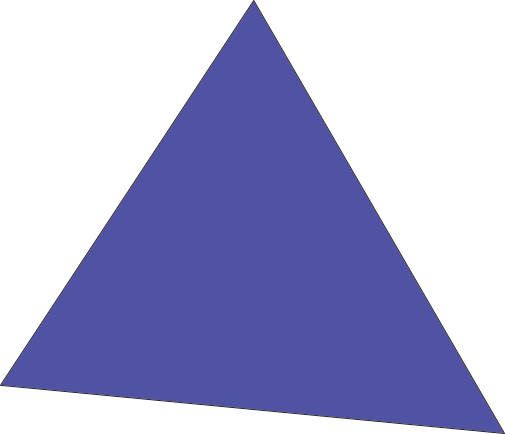

Week 1
=====================================

Week 1 wil een *level playing field* geven voor alle studenten. Na het doornemen van week 1 weet je de grondbeginselen van information security:

* Gevoeligheid in data
* Wat is een **vulnerability**?
* Wat is een **exploit**?
* Wat is een hacker eigenlijk? En zijn er wel hackers?
* Niet benoemd in de Powerpoint-Slides, maar wel belangrijk: CIA: **Confidentiality**, **Integrity** en **Availability**

Even kijken of images werken.

